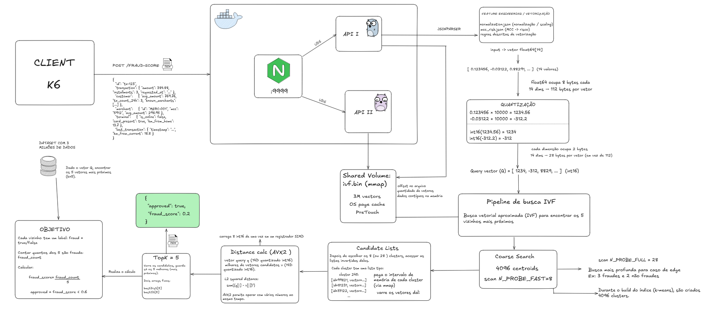

# Rinha de Backend 2026

Minha solução pra Rinha de Backend 2026, o desafio de detecção de fraude com busca vetorial. Escrito em [Go](https://go.dev/), o sistema recebe transações de cartão via HTTP, transforma cada uma num vetor de 14 dimensões, busca as 5 transações mais parecidas num índice de 3 milhões de referências e devolve um score de fraude.

Com a limitação de fazer isso tudo rodando com **1 CPU e 350 MB de RAM**, divididos entre nginx e 2 instâncias da API.

## Como rodar

### Pré-requisitos

- Docker + Docker Compose
- k6 (opcional, só se quiser rodar o benchmark local)

### Rodando o projeto

```bash
# Clone o repositório
git clone https://github.com/pettecco/rinha-de-backend-2026-go.git
cd rinha-de-backend-2026-go

# Build da imagem (gera o índice IVF com os 3M de vetores)
# Primeira vez demora uns 3 minutos, depois o Docker cacheia
make build

# Sobe nginx + 2 APIs
make up

# Testa se está up
curl http://localhost:9999/ready

# Roda o benchmark (precisa do k6 instalado)
make bench

# Acompanha os logs
make logs

# Derruba tudo
make down
```

### Sem Makefile?

```bash
docker compose build
docker compose up -d
k6 run test/test.js
docker compose down
```

## Arquitetura



O nginx divide as requisições entre as duas APIs via Unix Domain Sockets. Cada API tem seu próprio limite de memória e CPU, e ambas compartilham o mesmo índice IVF via volume Docker.

## Estrutura do projeto

```
.
├── cmd/
│   ├── api/              # API HTTP (fasthttp, Unix socket)
│   └── indexer/          # Gera o ivf.bin a partir do dataset
├── internal/
│   ├── consts/           # Constantes globais
│   ├── ivf/              # Busca IVF (runtime)
│   │   └── builder/      # Build do índice (k-means, writer)
│   ├── quantize/         # Quantização float64 → int16
│   ├── simd/             # AVX2 intrinsics + fallback escalar
│   └── vector/           # Vetorização do payload
├── dataset/              # references.json.gz, mcc_risk.json, normalization.json
├── test/                 # Script k6 + dados de teste
├── docker-compose.yml
├── nginx.conf
└── Makefile
```

## Configuração

Variáveis de ambiente no `docker-compose.yml`:

| Variável       | Padrão | O que faz                                              |
| -------------- | ------ | ------------------------------------------------------ |
| `N_PROBE_FAST` | 8      | Clusters varridos no estágio rápido                    |
| `N_PROBE_FULL` | 28     | Clusters varridos no estágio completo (casos de borda) |
| `GOMAXPROCS`   | 1      | Threads do Go (1 evita contenção)                      |
| `GOMEMLIMIT`   | 150MiB | Limite soft de heap                                    |

## O desafio

A Rinha de Backend 2026 é sobre detecção de fraude com busca vetorial. Para cada transação recebida:

1. Transforma o payload num vetor de 14 dimensões
2. Busca as 5 transações mais parecidas nos 3 milhões de referências
3. Calcula `fraud_score = fraudes_entre_as_5 / 5`
4. Responde com `approved = fraud_score < 0.6`

O contrato completo da API se encontra em [docs/br/API.md](./docs/br/API.md) e as regras de detecção em [docs/br/REGRAS_DE_DETECCAO.md](./docs/br/REGRAS_DE_DETECCAO.md).

## Documentação completa (fornecido pela Rinha)

- [API.md](./docs/br/API.md) — Contrato dos endpoints
- [ARQUITETURA.md](./docs/br/ARQUITETURA.md) — Restrições de infra
- [REGRAS_DE_DETECCAO.md](./docs/br/REGRAS_DE_DETECCAO.md) — As 14 dimensões e fórmulas
- [BUSCA_VETORIAL.md](./docs/br/BUSCA_VETORIAL.md) — Intro a busca vetorial
- [DATASET.md](./docs/br/DATASET.md) — Formato dos arquivos de referência
- [AVALIACAO.md](./docs/br/AVALIACAO.md) — Como a pontuação é calculada
- [SUBMISSAO.md](./docs/br/SUBMISSAO.md) — Como participar
- [FAQ.md](./docs/br/FAQ.md) — Dúvidas frequentes

## Tecnologias usadas

- **Go 1.24** — Linguagem principal
- **fasthttp** — HTTP server de alta performance
- **jsonparser** — Parse de JSON sem alocações
- **Docker + nginx** — Load balancing e containerização
- **IVF (Inverted File Index)** — Índice de busca vetorial
- **AVX2 intrinsics** — SIMD pra distância entre vetores

## Créditos

Desafio criado pela comunidade da Rinha de Backend. Mais informações em https://github.com/zanfranceschi/rinha-de-backend-2026
